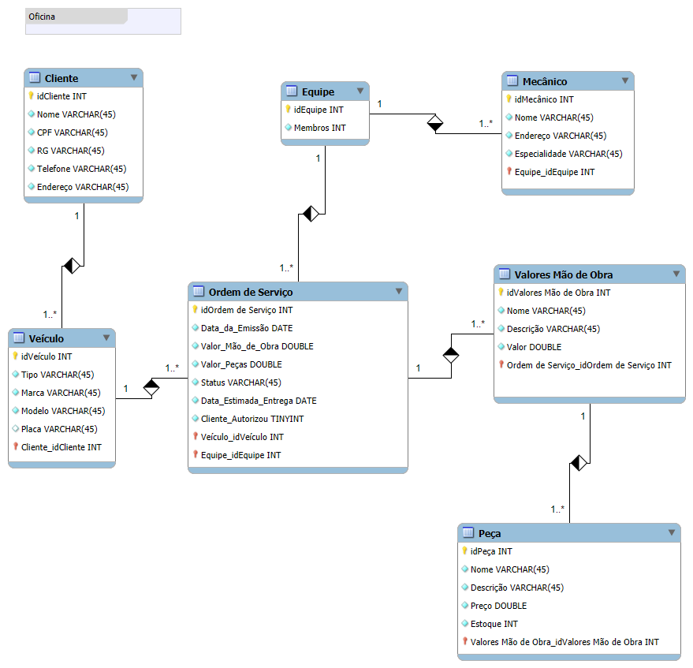

# ⚙️ Sistema de Gerenciamento de Oficina Mecânica

## 📄 Descrição
Este projeto é um estudo acadêmico de um sistema para controle e gerenciamento de ordens de serviço de uma oficina mecânica. O objetivo é compreender a modelagem de banco de dados e a organização de entidades relacionadas a um contexto real.

---

## 📊 Diagrama do Banco de Dados

---

## 🗂️ Estrutura do Banco de Dados

### Tabelas principais:
1. **👤 Cliente**: Armazena informações pessoais e de contato dos clientes.
2. **🚗 Veículo**: Relacionado a um cliente, armazena informações sobre os veículos registrados.
3. **👥 Equipe**: Representa equipes de mecânicos responsáveis pelas ordens de serviço.
4. **🔧 Mecânico**: Contém informações sobre os mecânicos, associados a equipes específicas.
5. **📋 Ordem de Serviço**: Detalha os serviços realizados, incluindo valores de mão de obra e peças utilizadas.
6. **💰 Valores Mão de Obra**: Lista os serviços realizados e seus respectivos valores.
7. **🔩 Peça**: Armazena as peças utilizadas em cada ordem de serviço, com preços e quantidade em estoque.
